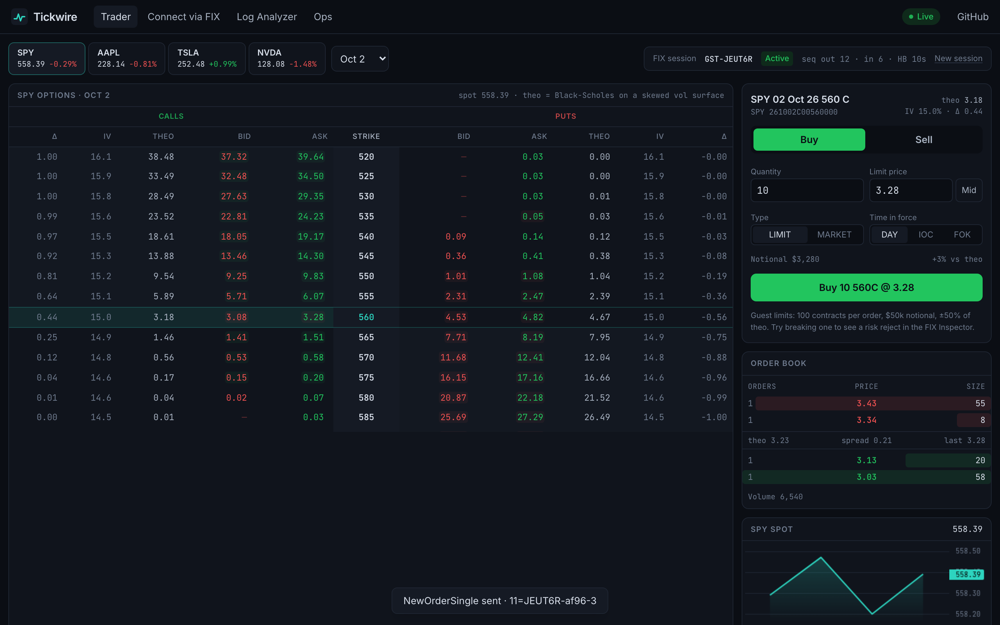
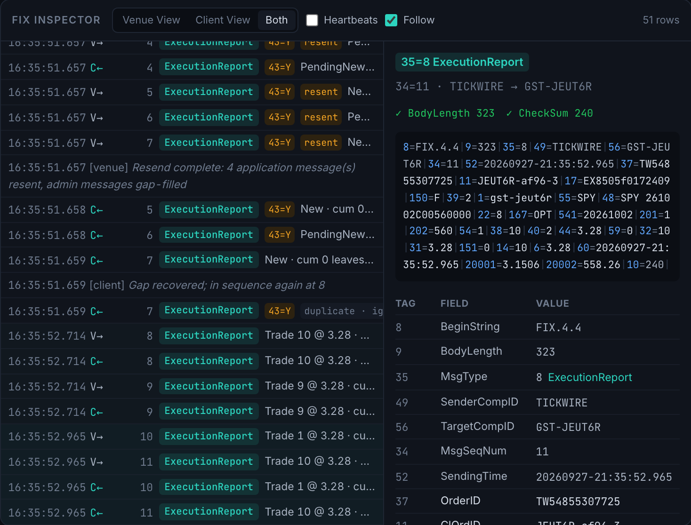
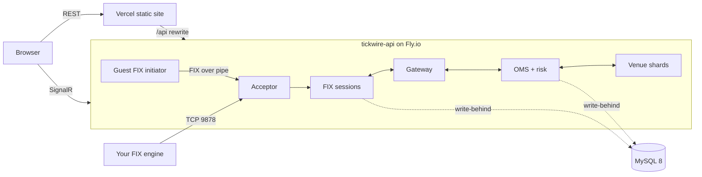

# Tickwire

**A FIX 4.4 engine and options execution gateway, written from scratch in C#/.NET 10, trading against a simulated
options market.** Every click in the web trader produces real FIX messages you can inspect, break on purpose, and
watch recover.

[](https://github.com/danialtoor/tickwire/actions/workflows/ci.yml)
[](https://github.com/danialtoor/tickwire/actions/workflows/deploy.yml)
[](https://github.com/danialtoor/tickwire/actions/workflows/prod-smoke.yml)
[](LICENSE)

**Live:** [tickwire-fix.vercel.app](https://tickwire-fix.vercel.app) · **API:** [tickwire-api.fly.dev/swagger](https://tickwire-api.fly.dev/swagger) · **FIX:** `tickwire-api.fly.dev:9878`

> Portfolio project. Not affiliated with any trading firm; simulated markets only, no real orders or money.



## Try it in 60 seconds

1. **Launch Trader.** You get a guest account with a FIX session. Click an ask in the SPY chain, then **Buy**. The
   Inspector shows `NewOrderSingle` going out, then `ExecutionReport`s coming back: PendingNew, New, then fills as
   the market makers requote through your price. Click any message to decode it tag by tag.
2. **Break it.** Open **⚡ Chaos**, click **Drop venue messages**, and send another order. The client sees a
   sequence gap, sends `ResendRequest (35=2)`, and the venue resends the lost reports with `PossDupFlag=Y` and
   gap-fills its heartbeats (`35=4, 123=Y`). The blotter shows the client's own view catching up with the OMS.
   Other faults: corrupt a checksum, go silent until `TestRequest` and logout, rewind sequence numbers.
3. **Debug a log.** Open **Log Analyzer**, load `broken-state-machine`, and read what went wrong and how to fix it.
4. **Bring your own engine.** On **Connect via FIX**, provision CompIDs and download a QuickFIX/n, QuickFIX/J or
   Python config. Your orders show up in the same blotter.

```bash
pip install simplefix
python clients/python/example.py --api https://tickwire-api.fly.dev
```



## What's inside

| | |
|---|---|
| **FIX codec** ([`Tickwire.Fix`](src/Tickwire.Fix)) | Zero-copy parser over `ReadOnlyMemory<byte>`, pooled builder, `System.IO.Pipelines` stream framer that resynchronizes after a bad BodyLength, vectorized checksum, FIX 4.4 data dictionary (loaded from `FIX44.xml`) with session-level validation. |
| **Session layer** ([`Tickwire.Fix.Session`](src/Tickwire.Fix.Session)) | Logon/logout, heartbeats, TestRequest, gap detection and queuing, ResendRequest, PossDup resend, GapFill, "MsgSeqNum too low", garbled-message handling per spec, persistent sequence numbers, TCP / WebSocket / in-memory transports, fault injection. |
| **OMS** ([`Tickwire.Engine`](src/Tickwire.Engine)) | Multi-leg spreads via NewOrderMultileg (35=AB) with all-or-none leg execution and strategy/leg reports (442=3/2), explicit order state machine, ClOrdID/OrigClOrdID chains, `CumQty + LeavesQty = OrderQty` invariants, pre-trade risk (size, notional, fat-finger band vs theo, open orders, allowed products, throttle), per-client and global kill switch, cancel-on-disconnect. |
| **Simulated venue** ([`Tickwire.Venue`](src/Tickwire.Venue), [`Tickwire.Pricing`](src/Tickwire.Pricing)) | Price-time priority books for about 540 option contracts, Black-Scholes theo and greeks on a skewed surface, GBM underlyings, market makers that requote every tick, implied vol by Newton with bisection fallback, OCC symbology. |
| **API** ([`Tickwire.Api`](src/Tickwire.Api)) | ASP.NET Core minimal APIs + SignalR, guest provisioning, per-client onboarding, OpenAPI at `/swagger`, MySQL via EF Core (config) and Dapper (hot path). |
| **Live market data** ([`Tickwire.MarketData`](src/Tickwire.MarketData)) | Bring your own key for SpiderRock (MLink), Databento (OPRA gateway), Polygon.io, Tradier or Alpaca; real quotes show beside the simulated ones, for that visitor only. See [docs/market-data.md](docs/market-data.md). |
| **Support tooling** | [Log Analyzer](src/Tickwire.LogAnalyzer) (library, `tickwire` CLI, API, and a TypeScript port held to the same test corpus), [PowerShell module](tools/powershell), [Python client and load generator](clients/python), [Rules of Engagement](docs/fix-spec.md), [support runbook](docs/runbook.md). |
| **Web** ([`web/`](web)) | React + TypeScript + Tailwind: chain, ticket, depth, blotter, FIX Inspector, Chaos panel, Ops dashboard, onboarding, analyzer. Falls back to a recorded session if the API is down. |

## Architecture



Each stateful piece (a FIX session, the OMS, each underlying's books) runs on its own single-threaded loop fed by a
channel, so there are no locks on the hot path. More in [docs/architecture.md](docs/architecture.md) and the
[ADRs](docs/adr).

## Performance

Codec micro-benchmarks (BenchmarkDotNet, .NET 10, Apple M2; full output in
[`bench/results`](bench/results/results)):

| Operation | Mean | Allocated |
|---|---:|---:|
| Parse NewOrderSingle (21 fields, verify BodyLength + CheckSum) | 300 ns | 352 B |
| Parse ExecutionReport (25 fields) | 345 ns | 400 B |
| Serialize NewOrderSingle (pooled buffer) | 383 ns | 40 B |
| Frame one message out of a stream buffer | 10 ns | 0 B |
| Validate against the FIX 4.4 dictionary | 949 ns | 384 B |
| CheckSum (SIMD) | 12 ns | 0 B |

End to end under load (`clients/python/loadgen.py`: 15 sessions, about 1,500 messages/s in and 3,000/s out
for 60 s, API and MySQL on the same laptop, zero rejects):

| Order → ack | p50 | p90 | p99 |
|---|---:|---:|---:|
| Inside the gateway (NewOrderSingle received → New ExecutionReport handed to the session, incl. risk, OMS and venue hops) | 26 µs | 54 µs | 463 µs |
| Seen by the Python client over TCP loopback (includes the client's own GIL-bound parsing) | 1.08 ms | 3.2 ms | 12.5 ms |

## Engineering notes

- **Written from scratch, checked against the standard.** The engine doesn't use QuickFIX/n. CI runs a QuickFIX/n
  initiator against the Tickwire acceptor over real TCP, forcing sequence gaps in both directions
  ([ADR 0001](docs/adr/0001-hand-written-fix-engine.md)).
- **Garbled messages are ignored, not rejected**, as FIX 4.4 requires. The next message exposes the gap and normal
  recovery takes over. The Chaos panel shows exactly that.
- **Replace can't overfill.** The venue sizes a replace against fills that happened after the client sent it.
- **Durable without blocking.** Sequence numbers and the resend store are in MySQL, written behind the session loop
  ([ADR 0004](docs/adr/0004-write-behind-session-store.md)). CI restarts the API and checks sessions continue.
- **Tests at every layer**: FsCheck properties (codec round-trip, any single-byte corruption is detected, put-call
  parity, fill invariants), deterministic session tests on a fake clock, OMS tests against the real venue, full-stack
  API tests, Testcontainers MySQL, Playwright, Pester, and a shared corpus that keeps the C# and TypeScript analyzers
  in agreement.

## Run it locally

```bash
cp .env.example .env && docker compose up -d --build   # MySQL + API (:8080 REST/SignalR, :9878 FIX)
cd web && npm install && npm run dev                   # http://localhost:5173
scripts/smoke.sh http://localhost:8080 localhost:9878
```

No Docker? `dotnet run --project src/Tickwire.Api` runs with in-memory persistence. See
[CONTRIBUTING.md](CONTRIBUTING.md) for tests and conventions.

## Repository layout

```
src/        Fix, Fix.Session, Pricing, Venue, Engine, Persistence, LogAnalyzer, Api, Cli
tests/      unit, property, session, engine, analyzer, integration (QuickFIX/n, API, MySQL)
bench/      BenchmarkDotNet
web/        React app, Playwright tests, replay recorder
clients/    Python FIX client, smoke test, load generator
tools/      PowerShell module Tickwire.Admin
samples/    broken FIX logs for the analyzer (with expected findings)
docs/       architecture, FIX Rules of Engagement, runbook, ADRs, decisions log
deploy/     Dockerfile, Fly.io configs
```

## License

MIT. `FIX44.xml` comes from QuickFIX/n under the QuickFIX license.
