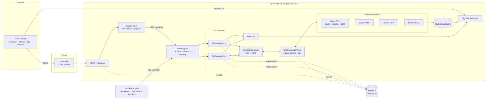
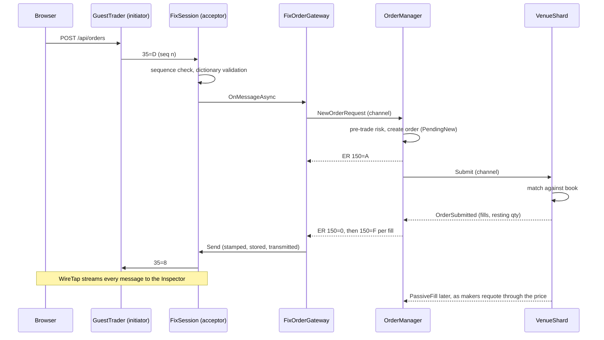
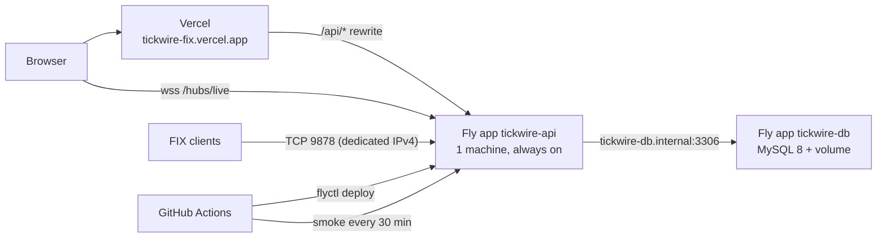

# Architecture

## Components

## One order, end to end

## Threading model

Stateful parts each run a single loop over a channel; nothing on the hot path takes a lock
([ADR 0002](adr/0002-single-threaded-loops.md)).

- **FixSession**, one per session: inbound bytes (from a per-connection read task), outbound sends, a 250 ms timer
  tick, admin commands. Owns sequence numbers, the out-of-order queue and heartbeat state.
- **OrderManager**, one: client requests and venue events share one channel, so a client always sees its reports
  in a consistent order.
- **VenueShard**, one per underlying ([ADR 0003](adr/0003-venue-sharded-by-underlying.md)): order submissions and the
  250 ms market tick (GBM step, Black-Scholes reprice, maker requote, noise trades).
- **Background writers**: the session store and the order/wire journal batch MySQL writes off the hot path
  ([ADR 0004](adr/0004-write-behind-session-store.md)).
- **LivePublisher** pushes to SignalR: session events as they happen, market snapshots at 4 Hz when data changed,
  ops metrics at 1 Hz.

Readers on other threads use immutable snapshots (`OrderView`, `QuoteSnapshot`) or ask the loop with an
`InvokeAsync` message.

## Projects

| Project | Depends on | What |
|---|---|---|
| `Tickwire.Fix` | | tags, parser, builder, framer, checksum, FIX 4.4 data dictionary |
| `Tickwire.Fix.Session` | Fix | session state machine, stores, transports (TCP, pipes, fault injection), acceptor/initiator |
| `Tickwire.Pricing` | | Black-Scholes and greeks, implied vol, OCC symbology, vol surface, GBM |
| `Tickwire.Venue` | Pricing | order books, market-making shards, market data cache |
| `Tickwire.Engine` | Fix.Session, Venue | OMS, order state machine, pre-trade risk, FIX gateway, metrics |
| `Tickwire.Persistence` | Engine | EF Core model and migrations, Dapper session store and journal |
| `Tickwire.LogAnalyzer` | Fix | log parsing, lifecycle reconstruction, diagnostics |
| `Tickwire.Api` | all | ASP.NET Core host: REST, SignalR, guests, WebSocket FIX, hosted services |
| `Tickwire.Cli` | LogAnalyzer | `tickwire` dotnet tool |

## Deployment

The frontend is static on Vercel. The backend must be a long-running process (matching engine, market makers, raw
TCP listener, WebSockets), which Vercel's serverless model can't host, so it runs on Fly.io. SignalR connects to
the API host directly because Vercel rewrites don't proxy WebSockets; CORS allows the Vercel production and preview
domains.
